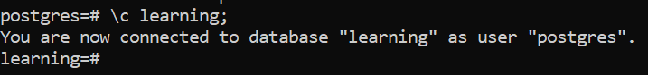

# Create database

- To create a database in SQL Shell, enter this command
```sql
CREATE DATABASE learning;
```

---

- ### and verify that the database is created using the `\l` command, this command will show all databases
```sql
\l
```
and if you look at the table you can see that a database named __`learning`__ has appeared
<div align=center>

</div>

---

- ### Connect to "learning" database
```sql
\c learning;
```
<div align=center>

</div>

---

