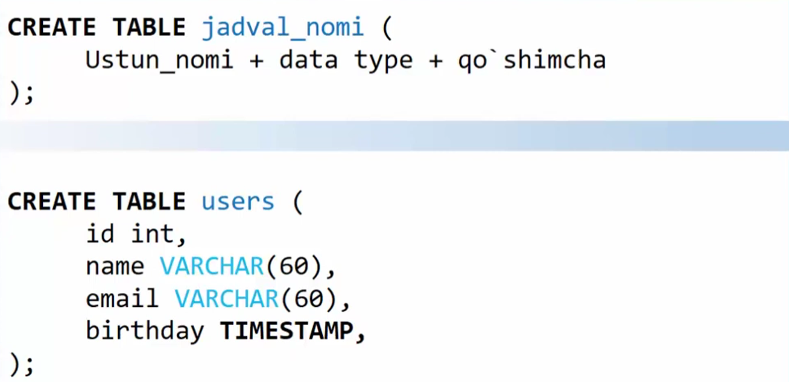
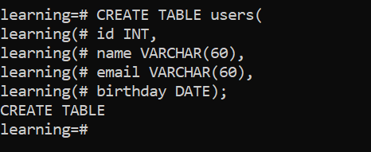
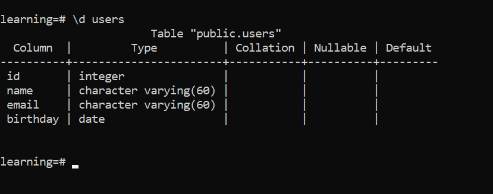
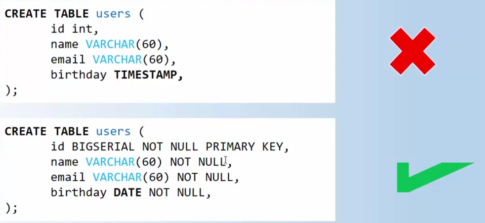
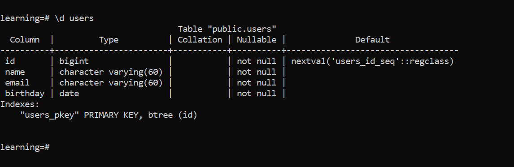

- ### CREATE TABLE

<div align=center width="150px">

</div>

```sql
CREATE TABLE users(
```

inside the table until the parenthesis is closed
```sql
id INT,
name VARCHAR(60),
email VARCHAR(60),
birthday DATE );
```

<div align=center>

</div>

to verify that the table has been created

```sql
\d
```

```sql
\d users
```
<div align="center">

</div>


## Best practis ✅
<div align="center">

</div>

- not null means it cannot be an empty value

```sql
DROP TABLE users,
```
- and so I deleted the old table

To check if table is deleted, type `\d`

and create new table

```sql
CREATE TABLE users(
id BIGSERIAL NOT NULL PRIMARY KEY,
name VARCHAR(60) NOT NULL,
email VARCHAR(60) NOT NULL,
birthday DATE NOT NULL );
```

and check table
```sql
\d users
```

<div align="center">

</div>

---